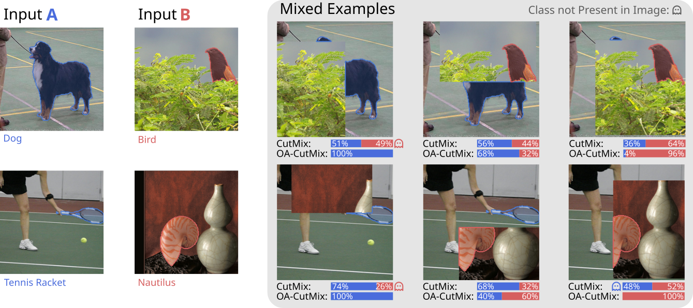

# OA-CutMix: Correcting the Label Bias of CutMix

[](https://huggingface.co/datasets/TNauen/Sam3-ImageNet-Segmentations)
[](LICENSE)



This repository contains the official implementation of **Object-Aware CutMix (OA-CutMix)**,
an object-aware label reweighting strategy for CutMix. It is built on top of
[OpenMixup](https://github.com/Westlake-AI/openmixup); see [Acknowledgement](#acknowledgement)
and [the original README content](#about-openmixup) below for the underlying framework.

## Introduction

CutMix has become the de facto standard mixing augmentation, yet its label
assignment rests on a flawed assumption: that the area of the pasted patch
faithfully reflects its semantic contribution to the mixed image. In practice,
patches frequently land on background regions and assign label credit to a
class whose object is not visible. We measure this bias and find:

- The mean absolute deviation between the CutMix label and the semantically
  correct object area is **21.5%**.
- In **17%** of CutMix samples, an image contributes **zero visible object
  pixels** yet still receives nonzero label weight — what we call _ghost labels_.
- For the smallest 20% of objects, ghost labels occur in **33%** of samples.

**OA-CutMix** corrects this bias by replacing the area-based CutMix weight with
one derived from precomputed segmentation masks, assigning labels in proportion
to the visible object area each image contributes to the mix. The image mixing
procedure is left **entirely unchanged**: masks are precomputed offline with
[SAM3](https://arxiv.org/abs/2511.16719), so there is **no training-time
overhead**.

## Installation

OA-CutMix is built on the OpenMixup framework. It is compatible with
**Python 3.8/3.9** and **PyTorch 1.12 / 2.x**.

```shell
# PyTorch 1.12
conda create -n openmixup python=3.8 pytorch=1.12 cudatoolkit=11.3 torchvision -c pytorch -y
conda activate openmixup
pip install openmim
mim install mmcv-full
git clone <this-repo>
cd openmixup
python setup.py develop
```

<details>
  <summary>Installation with PyTorch 2.x</summary>

```bash
conda create -n openmixup python=3.9
conda activate openmixup
pip install torch==2.1.0 torchvision==0.16.0 torchaudio==2.1.0 --index-url https://download.pytorch.org/whl/cu118
pip install https://download.openmmlab.com/mmcv/dist/cu118/torch2.1.0/mmcv_full-1.7.2-cp39-cp39-manylinux1_x86_64.whl
pip install -r requirements/runtime.txt
python setup.py develop
```

</details>

For more detailed installation and dataset preparation, please refer to
[install.md](docs/en/install.md).

## Getting Started

### Precomputed Segmentation Masks

OA-CutMix requires SAM3 masks for each training image. We release the masks we used for all benchmarks; see [`configs/classification/<dataset>/load_masks_train_val.py`](configs/classification)
for the loading configs (one per dataset: CIFAR-100, TinyImageNet, ImageNet-200, CUB-200, Aircraft, Cars).

If you wish to generate masks yourself, see the scripts under [`tools/`](tools/) and the mask-generation utilities in [`scripts/`](scripts/).

### Training

Configs for all OA-CutMix experiments live under
`configs/classification/<dataset>/<arch>/cutmix_fga/`. A typical run:

```shell
# Single GPU
bash benchmarks/classification/run_configs.sh

# Multi-GPU
bash tools/dist_train.sh \
    configs/classification/tiny_imagenet/r18/cutmix_fga/r18_cutmix_fga_rel_l1p0.py 4
```

Config names follow the convention
`<arch>_cutmix_fga_<mode>_l<lambda>.py`, where `<mode>` is `abs` or `rel` and
`<lambda>` is the OA mixing weight (default `1p0` = full OA-CutMix).

### Evaluation

```shell
bash tools/dist_test.sh ${CONFIG_FILE} ${GPUS} ${PATH_TO_MODEL}
```

## Ablations

We include scripts and configs for the ablations from the paper:

- **Mask quality** — progressively degraded masks (inter-class shuffle,
  intra-class shuffle, bounding box, SAM3, human annotations) for CUB-200
  and TinyImageNet. See `configs/.../*_human_masks.py` and
  `scripts/mask_degradation.py`.
- **Robustness** — FGSM/PGD evaluations under `tools/`.
- **Label-error analysis** — per-image label-error analysis and accuracy-vs-
  object-size plots used in Figs. 4–5.

## Citation

If you find OA-CutMix useful in your research, please cite:

```bibtex
@article{oacutmix,
  title  = {OA-CutMix: Correcting the Label Bias of CutMix},
  author = {Anonymous},
  year   = {2026}
}
```

If you use this codebase, please also cite the underlying OpenMixup framework:

```bibtex
@article{li2022openmixup,
  title  = {OpenMixup: A Comprehensive Mixup Benchmark for Visual Classification},
  author = {Siyuan Li and Zedong Wang and Zicheng Liu and Di Wu and Cheng Tan and Stan Z. Li},
  journal = {ArXiv},
  year   = {2022},
  volume = {abs/2209.04851}
}
```

## License

This project is released under the [Apache 2.0 license](LICENSE).

## Acknowledgement

This repository is a fork of and built on top of
[OpenMixup](https://github.com/Westlake-AI/openmixup), an open-source toolbox
for mixup-based visual representation learning. We thank the OpenMixup
authors and all upstream contributors. OpenMixup itself borrows from
[MMPreTrain](https://github.com/open-mmlab/mmpretrain). We additionally rely
on [SAM3](https://arxiv.org/abs/2511.16719) for offline mask generation.

---

## About OpenMixup

The sections below describe the underlying OpenMixup framework that this
codebase extends. OA-CutMix re-uses the OpenMixup registry system, config
format, and training pipeline; new components (the foreground/object-aware
CutMix policy, mask data sources, and additional configs) are added on top.

`OpenMixup` is a modular PyTorch toolbox for supervised, semi-, and
self-supervised visual representation learning with a focus on mixup data
augmentation.

<details>
<summary>Major Features (OpenMixup)</summary>

- **Modular Design.** Decomposed framework based on the OpenMMLab architecture;
  new components are added via a registry and config dict.
- **All in One.** Popular backbones, mixup methods, semi-supervised and
  self-supervised algorithms in a single framework.
- **Standard Benchmarks.** Image classification, mixup classification,
  self-supervised evaluation, and downstream tasks.
- **State-of-the-art Methods.** Long lists of mixup and self-supervised methods.

</details>

<details>
<summary>Supported Backbones (OpenMixup, partial list)</summary>

ResNet, ResNeXt, SE-ResNet, MobileNetV2/V3, EfficientNet(V2), HRNet, Res2Net,
RegNet, ViT, Swin, PVT, T2T-ViT, LeViT, DeiT/DeiT-3, MLP-Mixer, Twins,
ConvMixer, BEiT, UniFormer, MobileViT, PoolFormer, ConvNeXt(V2), MViTV2,
RepMLP, VAN, LITv2, HorNet, DaViT, EdgeNeXt, EfficientFormer, MogaNet,
MetaFormer, MobileOne, VanillaNet, UniRepLKNet, TransNeXt, StarNet, …

</details>

<details>
<summary>Supported Mixup Methods (OpenMixup)</summary>

Mixup, CutMix, ManifoldMix, FMix, AttentiveMix, SmoothMix, SaliencyMix,
AugMix, PuzzleMix, SnapMix, GridMix, ResizeMix, AlignMix, TransMix, AutoMix,
SAMix, TokenMix, MixPro, DecoupleMix, SMMix, TLA, GuidedMixup, AdAutoMix,
SUMix, MergeMix — and now **OA-CutMix** (this work).

</details>

For OpenMixup's full documentation, model zoo and tutorials, see the
[upstream repository](https://github.com/Westlake-AI/openmixup) and
[`docs/en/`](docs/en/).
